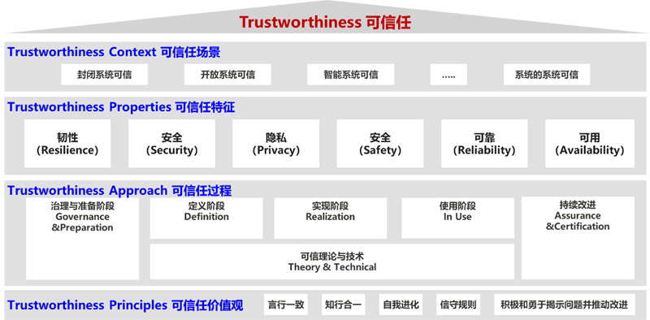

# 前言

文档为个人平时生活收集和工作积累，不涉及商用，仅供学习和参考。请尊重信息、尊重开发者、勿在商业模式下传播。

提高代码质量，希望大家好好学习，天天向上

> Thank you for ZTE、HUAWEI、ByteDance and EveryOne

# 可信软件

- **安全性**（Security）：产品有良好的抗攻击能力，保护业务和数据的机密性、完整性和可用性。

- **韧性**（Resilience）：系统受攻击时保持有定义的运行状态（包括降级），遭遇攻击后快速恢复并持续演进的能力。

- **隐私性**（Privacy）：遵从隐私保护既是法律法规的要求，也是价值观的体现。用户应该能够适当地控制他们的数据的使用方式。信息的使用政策应该是对用户透明的。用户应该根据自己的需要来控制何时接收以及是否接收信息。用户的隐私数据要有完善的保护能力和机制。

- **安全性**（Safety）：系统失效导致的危害不存在不可接受的风险，不会伤害自然人生命或危及自然人健康，不管是直接还是通过损害环境或财产间接造成的。

- **可靠性和可用性**（Reliability& Availability）：产品能在生命周期内长期保障业务无故障运行，具备快速恢复和自我管理的能力，提供可预期的、一致的服务。

> 软件设计原则：*可读性、可维护、安全、可靠、可测试、高效、可移植*。